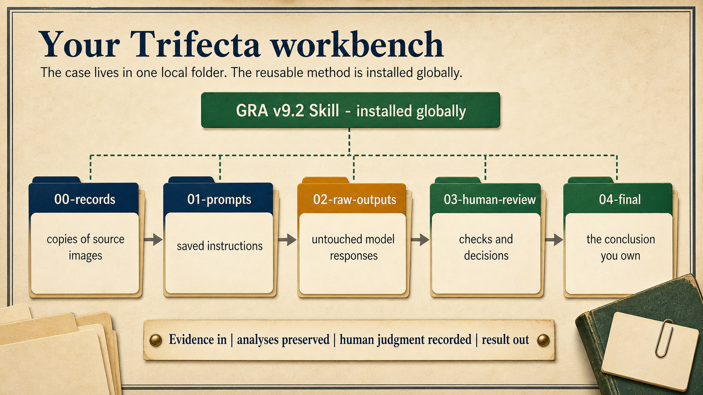

<!-- markdownlint-disable MD013 MD034 -->

# Trifecta: One Genealogist, Two AI Assistants, One Folder

*A complete Fun Prompt Friday guide to the new workbench: put GPT-5.6 and Claude to work side by side, give both the free Genealogical Research Assistant v9.2, and put your evidence, not a chatbot, at the center of your research.*

This complete reference edition accompanies the guided Substack article. Product names, prices, plan requirements, and promotional details were checked on July 10, 2026 and may subsequently change. Article text and original infographics are © 2026 Steve Little and licensed under [CC BY-NC-SA 4.0](https://creativecommons.org/licenses/by-nc-sa/4.0/).

## 0. Before You Read: A Note About Dates

The dated facts in this article, including product names, prices, plan requirements, and the limited-time model offer described inside, were checked against official documentation and a working system on Friday, July 10, 2026. Descriptions of screens and of the fresh-install experience are drawn from that same day but have not all been re-walked from a clean machine, so treat them as a faithful sketch rather than a guarantee. If you are reading later, some details will have drifted; software companies rename things the way rivers move their banks. This is a one-time article, written and published in a single push, not a manual I will keep updated.

Read it anyway. The screens and prices are the perishable part. The result is not. By the end you will have one genealogist (you), two AI assistants, one folder on your own computer, and one shared method for making their work inspectable. Buttons move; that arrangement will still work when they do.

---

## 1. The Chat That Forgets

Somewhere in your AI chat history is a genuinely good piece of research. Maybe it was the afternoon you and ChatGPT finally untangled two same-named cousins, or the evening Claude helped you read every line of a water-damaged death certificate. It was careful work. You were proud of it.

Now try to find it.

If you use AI for family history, you already know this frustration. An ordinary standalone chat keeps no working memory you can hand forward, so the census page you explained so carefully last month often has to be explained again today. The analysis you refined across forty messages lives somewhere in an endless scroll, in a chat with a name like "Death certificate question (3)." And there is a quieter cost, easy to miss: when one assistant gave you one confident answer, nobody else ever checked it. The work was real, but it is stored as conversation, and conversation is hard to recover as a durable working file.

Here is the sentence this whole article hangs on: **a chat is a conversation; a folder is a workbench.**

On a workbench, the work stays put. The record you copied there yesterday is still there today. The analysis an assistant writes for you becomes a file you can open, rename, print, back up, or hand to someone else; including, as you will see, to a different AI assistant for a second opinion. And when those two assistants disagree, you have not found a problem. You have found the most valuable thing this arrangement produces: a disagreement you can see, weigh against the record, and settle yourself.

That last part deserves saying plainly, because it is the heart of everything that follows. Every time you have accepted a single AI's confident answer, other plausible readings may have existed invisibly beside it. Two assistants at one bench do not create the uncertainty; they surface it, and they hand the decision back to the person qualified to make it. That is you. In this arrangement you are not a passenger. The assistants extract, transcribe, suggest, and challenge; you choose the question, you inspect the record, and you own the conclusion. It has always been you.

Nothing about your genealogy has to change to work this way. The standards you already respect—careful transcription, complete citation, and a healthy suspicion of tidy answers—transfer directly. What changes is where the work lives.

Why write this now, and why at such length? Because this particular weekend is unusually good for building the bench. As of publication, Claude's newest and most capable model, Fable 5, is included at no extra cost with eligible paid Claude plans, but only through Sunday, July 12, 2026. Section 6 gives the exact terms. The same week, OpenAI released its newest models and folded its desktop tools into one new app. Two frontier assistants, one weekend, one bench.

But notice what that deadline actually teaches. The included promotional access to this weekend's model will end; after that, Fable remains available on a pay-as-you-go basis; Section 6 explains how that billing works. New models will keep arriving; prices will change and apps will be renamed. That churn is the argument for the workbench. A folder of your own files, a method installed in each assistant and reused across every case, a habit of second opinions: none of that expires Sunday night. Build the bench this weekend because the timing is good. Keep it because the bench outlives every model that visits it.

---

## 2. Choose Your Route

This article does two jobs: it teaches a durable method, and it walks you through the setup as it stood on July 10, step by step. If a button has moved by the time you read this, Section 17 tells you what to do. Find your row below and take the route on the right.

| If this is you | Your route |
| --- | --- |
| New to folder-based AI work | Read straight through, Sections 1-18 |
| Comfortable with AI apps, new to local projects | Section 1, then Sections 4-18 |
| Already have both desktop apps installed | Begin with Section 6. In Sections 8 and 11, skip only the download and sign-in steps; still open the dedicated folder and verify model and permission controls. Install GRA for each assistant in Sections 9 and 12 |
| Want only the method, not the setup | Sections 1, 5, 10, and 14-18 |
| Cannot use the featured paid models | Read Sections 6 and 7, then go to Sections 11 and 12 for the Codex-first setup. Return to Section 10 and run its adaptable analysis prompt in Codex. Read Sections 13–18 as the method and worked example, but defer the independent comparison and handoffs until a second assistant from another company is available |

There are two finish lines. Section 10 ends with a working one-assistant system: one app, one folder, one saved analysis of a real record. Section 16 ends with the complete two-assistant system: a second opinion, a preserved disagreement, and a conclusion you adjudicated yourself. Reaching only the first checkpoint this weekend still leaves you something worth keeping.

Table of contents:

1. [The Chat That Forgets](#1-the-chat-that-forgets)
2. [Choose Your Route](#2-choose-your-route)
3. [You Did Not Miss the Prerequisites](#3-you-did-not-miss-the-prerequisites)
4. [Where the Files Live, Where the Thinking Happens](#4-where-the-files-live-where-the-thinking-happens)
5. [Meet the Trifecta](#5-meet-the-trifecta)
6. [Cost, Access, and the Safety Compact](#6-before-you-begin-cost-access-and-the-safety-compact)
7. [Build the Smallest Workbench](#7-build-the-smallest-workbench)
8. [Install Claude Desktop and Open Claude Code](#8-install-claude-desktop-and-open-claude-code)
9. [Install GRA Globally for Claude](#9-install-gra-globally-for-claude)
10. [First Success: One Durable Analysis File](#10-first-success-one-record-set-one-durable-analysis-file)
11. [Add the Second Assistant](#11-add-the-second-assistant-install-the-new-chatgpt-desktop-app-and-enter-codex)
12. [Install GRA Globally for Codex](#12-install-gra-globally-for-codex)
13. [Which Model Should You Choose?](#13-which-model-should-you-choose)
14. [The Short Head-to-Head](#14-the-short-head-to-head)
15. [The Durable Method](#15-the-durable-method-two-assistants-hand-work-across-one-bench)
16. [What You Should Now Have](#16-what-you-should-now-have)
17. [When the Screen Does Not Match](#17-when-the-screen-does-not-match)
18. [Ownership and What Comes Next](#18-ownership-attribution-privacy-sharing-and-what-comes-next)

---

## 3. You Did Not Miss the Prerequisites

Custom GPTs, Gems, NotebookLM, and AI "projects" are not prerequisites for this method. You do not need to catch up on them before starting here. A short map of the last three years will make everything that follows easier to place.

Hockey people like to quote Wayne Gretzky: skate to where the puck is going, not to where it has been. I borrowed that line last December to describe where AI tools for genealogy were heading, and tonight, a little over six months later, the map needs updating.

In 2023, the puck was chat. We learned to ask, to paste a transcription, to push back on a wrong answer. What persisted from a session was mostly your own skill at the conversation; the conversation itself scrolled away.

In 2024, the puck moved to saved instructions: Custom GPTs on the OpenAI side, Gems on Google's. Instead of retyping "you are helping with genealogy; cite carefully; do not guess" into every conversation, you could save that guidance into a named helper and use it again and again. Now your instructions persisted, even though each conversation still started fresh.

In 2025, the puck moved to projects: cloud workspaces where instructions, files, and conversations could finally live together in one place. NotebookLM did something similar for collections of sources. For the first time, your AI work had an address; instructions, context, and files all persisted between visits.

In 2026, the puck is here: an ordinary folder on your own computer. The newest desktop apps from OpenAI and Anthropic can open a plain local folder, read the files inside, and, with your permission, write new ones. Now everything persists, including the thing this article cares most about: a repeatable method you can carry from one family, one project, and one model to the next. The address of your research is finally a place you own.


**Five doors, one task.** One genealogy task, extracting the names, dates, places, and relationships from a record, can run at any of five levels: a prompt typed in the moment, a saved prompt, a Custom GPT or Gem, a project, or an installed Skill. The numbers order the tour, not your homework. The five stations sit at the same height on the same bench on purpose; nobody has to graduate through Custom GPTs or a cloud project before opening a local folder. The levels also combine: a Skill installed once, globally, can guide the work you do inside a local project folder. The banner at the bottom is the whole strategy, and I mean it: start simple; add structure only when reuse is worth it. These are choices, not prerequisites. Rendered with gpt-image-2 from my original teaching slide.

(One disclosure, here at the first illustration: the archival-looking scenery in this article's images is illustrative and generatively produced. It is decoration, not historical evidence.)

Each stage rescued more of the work product from a disposable conversation: first instructions, then files and context, and now the reusable method. In this arrangement, GRA is installed once for each assistant and reused across cases, while each case stays in a folder you own. The folder holds the work; the assistants load the method.

Two cautions keep that timeline accurate. First, the years mark where most people's attention was, not when things were invented; projects existed before 2025, folder-based work before 2026, and the eras overlap. Second, names do not always mean the same thing from company to company, so choose tools by the task, not by the feature name.

Custom GPTs, Gems, and cloud projects remain useful, but they are not homework. If you can hold an AI conversation and make a folder, you have the conceptual prerequisites. The practical requirements—a supported computer, Git, and a paid Claude plan or Console account—appear before installation in Sections 6 and 8.

There is one more stop already visible past this one: models that run entirely on your own machine, where the files and the thinking both stay home. Tools like LM Studio point there. That is a future article; tonight we are building the bench the puck just reached.


**The direction of travel.** This is my read of where AI-assisted genealogy is heading, drawn as a path toward a horizon: from local, folder-based work, to local AI harnesses that are more than a chat box (a harness is a desktop app, like Claude Code or Codex mode, that works with your files rather than only chatting), to assistants that orchestrate work instead of just handing back answers. A forecast is a forecast; I am marking waypoints I can already watch people reaching, not promising a schedule. And like the 2023-2026 stages behind us, these are overlapping centers of attention, not exclusive eras; nothing on this path expires the moment the next marker appears. The note clipped to the corner is the old Gretzky advice I have leaned on since December: skate to where the puck is going. The puck is already moving toward your file system. Rendered with gpt-image-2 from my original illustration.

---

## 4. Where the Files Live, Where the Thinking Happens

Before you create any folder or install any app, you deserve a clear picture of what is about to happen where. Three ideas establish the boundary.

First: the source folder stays on your machine, but the model's reasoning happens on company servers, and shared material may be retained under your account and service settings. Local files do not make the AI local. If a record is too sensitive for a cloud service, it is too sensitive for this workflow.

Second: this is not an app-bound cloud project. It is a plain folder in File Explorer or Finder. You create and name it, and its files remain openable if every AI app is removed.


**Local files, cloud thinking.** Here is the honest map I wish someone had drawn for me. Ordinary chat and cloud Projects live entirely in the cloud; that is the top row. The green folder on the desk is the newer kind of work: Cowork, Claude Code, and Codex, now a mode inside the unified ChatGPT desktop app, operate on files that stay on your machine. But follow the beam of light. When a cloud model does the reasoning, the material it reads still travels to that model. Your folder is local; the thinking, for now, is not, and a dedicated sandbox folder is how you limit what can travel. The blue LM Studio folder beside it is the fully local horizon, a story for another article. Local files do not make the model local. Rendered with gpt-image-2 from my original diagram.

Third idea, and the one new word this section asks you to learn: an assistant that can look inside your folder and, with your permission, create or change files there is called an agent. You will see the word on buttons and in menus, so it is worth defining plainly. A chat answers you; an agent can also act, and the acting is precisely what makes a folder into a workbench, because the analysis it writes becomes a real file you keep. These apps put agents behind permission systems, and how much you are asked depends on the permission mode currently in effect. The one flow this article can state flatly, because it was tested: in Claude's Manual mode, each proposed file appears as a marked-up preview, and nothing is written until you click Accept. Other modes ask less often, which is exactly why the setup sections tell you which mode you are in. This article will tell you at each step what you are being asked and what saying yes will do.

Put the three ideas together and you get the reason for one firm rule that governs the whole setup: the agents get one dedicated folder, created just for this work, holding copies of records rather than your only originals, and nothing else. Not your Documents folder, not your whole genealogy archive, and never your only copy of anything. The dedicated folder is not a guaranteed wall; it is risk reduction: it narrows what you have invited the agent to touch, and it keeps a recovery copy of everything close at hand. If an assistant misreads, mangles, or deletes something, you are looking at a folder you built in five minutes and can rebuild in five more. Genealogists already live by this instinct; you would not hand a stranger the original family Bible when a photocopy will do. The dedicated folder is the photocopy.

That is the whole mental model: local files, cloud thinking, one agent-accessible folder, narrow permissions, and copies you can afford to lose. The local half you can verify yourself in File Explorer; the cloud half is a decision about what you share, made deliberately, folder by folder. With the boundary clear, you are ready to meet the three tools this article features.

---

## 5. Meet the Trifecta

This article features three components: GPT-5.6, Claude Fable 5, and GRA v9.2. Before you install anything, it is worth sorting those three, plus the two desktop applications that carry them, into four layers that do different jobs. Then, when the walkthrough says "select the model" or "install the Skill," you will know which layer you are touching.

**The engines.** GPT-5.6 and Fable 5 are models: the reasoning engines that read the text and images you supply and produce language in response. GPT-5.6 is OpenAI's current family, offered in three sizes named Sol, Terra, and Luna; Sol is the flagship featured in this article. Fable 5 is Anthropic's most capable widely released model, placed in a new tier the company calls Mythos, above Opus, until now its most capable model line. Each family also includes smaller, faster siblings; those return in Section 13, when you choose a model deliberately. The two flagships are featured this weekend because they are new and unusually capable. They are not the method. Models rotate constantly; by the time you read this, the names on the menu may already have changed, and the workflow you are about to build will not care.

**The workbench surfaces.** ChatGPT Desktop and Claude Desktop are the two applications you will actually install. Each one gives a model a way to work with files on your computer instead of only answering inside a chat box. On the OpenAI side, that working mode is called Codex, and it now lives inside the unified ChatGPT Desktop app. On the Anthropic side, it is called Claude Code, reached through Claude Desktop. Keep one rule from the official model documentation in mind throughout: the model supplies the reasoning, and the desktop app supplies the workbench. Files, tools, permissions, skills, and any helpers belong to the app and your plan, not to the model. A capable model cannot use a tool the app has not given it.

**The method.** GRA v9.2, the Genealogical Research Assistant, is the third element of the Trifecta, and it is the one most easily misfiled. GRA is not a model, not a third assistant, and not software that acts on its own. It is a reusable set of written instructions: a genealogical methodology, authored by Steve Little and shared without charge for permitted noncommercial use under CC BY-NC-SA 4.0 (Section 18 explains what the license asks of you), that guides whichever assistant is reading it through evidence analysis, source and information classification, conflict resolution, citation, living-person privacy, and calibrated conclusions. GRA is GPS-aligned, meaning it is designed to follow the Genealogical Proof Standard, the field's benchmark for sound conclusions. Aligned is the precise word. GRA guides; it does not enforce, guarantee, or certify anything, and it never removes the need for your own verification, because an AI model can still be wrong. You will install GRA once for each assistant, in a user-wide location, so the same method is available to every compatible project without reinstalling. The walkthrough then has each assistant report the GRA version and location it actually loaded, so availability is confirmed rather than assumed.

**The director.** The fourth layer is you. You choose the question and folder, control permissions, examine the records, resolve disagreements, protect living people, and own every conclusion and publication decision. Models can extract, correlate, critique, and draft; responsibility does not transfer.

In earlier talks I called a two-assistant setup a left brain and a right brain. I am retiring that shorthand here. Neither vendor is permanently the analyst or writer. Assign reversible roles for each task: one extracts while another reviews, one drafts while another audits, then swap them when useful.

So: two engines, two workbenches, one shared method, one director. The engines are this weekend's news. The rest is the part you will still be using next year.

---

## 6. Before You Begin: Cost, Access, and the Safety Compact

Money first, plainly, before either application touches a folder. Two different companies are involved, and each requires its own account. The featured route in this article is not free, and one piece of it is on a clock.

### What is included, and what may cost extra

You can learn the folder-and-GRA method without buying every flagship model. The featured Sol and Fable pairing uses paid plans; the lower-cost route begins with the strongest models and tools your accounts already provide.

| | Featured frontier route | Accessible methodology route |
| --- | --- | --- |
| OpenAI side | ChatGPT Plus or higher, which exposes GPT-5.6 Sol in Codex; eligible paid plans can also select Terra and Luna | ChatGPT Free and Go include Codex with GPT-5.6 Terra, subject to plan limits |
| Anthropic side | A paid Claude plan or a Console account (Anthropic's pay-as-you-go developer account) for Claude Code; promotional Fable 5 access belongs only to eligible paid subscription seats (Pro, Max, Team, and premium Enterprise) | Claude's free plan does not include Claude Code; a paid Claude plan or a Console account is required for the second local-folder assistant |
| What you can do | Follow the complete two-assistant demonstration with Sol and Fable 5 | Begin with one dedicated folder, GRA, saved files, explicit permissions, and human review in Codex; add Claude Code when a paid plan makes it available |
| The cost boundary | Each company requires its own paid subscription. Fable 5 is included only up to 50% of the eligible plan's weekly limits, and only through Sunday, July 12, 2026, at 11:59:59 PM Pacific Time. After that window, Fable use requires prepaid usage credits billed at standard API rates | The complete two-workbench setup is not free. GRA v9.2 itself is shared without charge for permitted noncommercial use under CC BY-NC-SA 4.0 (Section 18 explains the terms); app and model access are governed separately by the vendors |

Keep three billing categories separate. A **subscription** provides the models included within plan limits; it does not provide API tokens. Fable's **temporary included access** is capped at 50% of eligible weekly limits through the deadline. Afterward, continued Fable use requires **prepaid usage credits** billed at standard API rates, currently $10 per million input tokens and $50 per million output tokens. API billing is separate from ordinary subscriptions. A token is a small piece of text; input is what you send and output is what the model returns.


**Tokens are the meter.** Before you grant any assistant access to a folder, you should know what the billing unit is. A token is a small chunk of text; the sentence in panel 1 breaks into eight of them, punctuation included. Panel 2 stacks the rough equivalences: a million tokens is approximately 750,000 words, roughly 2,500 to 3,000 book pages, about five average Harry Potter books. Every wavy equals sign in that row is deliberate. The ratios shift with the text being counted, so treat these as a sense of scale, not arithmetic you can bill against. And the meter runs on what a model reads and on what it writes; the tagline puts it plainly: tokens are the meter, the model is the engine. The meter runs both ways. Refreshed with gpt-image-2 from my June token infographic.

Verified Friday, July 10, 2026. Plans, limits, promotions, prices, rollouts, and model names can change; check the vendors' current plan and help pages if your screen differs.

That is the money. The compact below is the conduct: ordinary workbench habits, not a claim that either desktop app is unsafe. Read them before either assistant receives folder access.

> ### Before you open the folder
>
> 1. **Make a small workbench.** Create one new folder for this case and open each assistant there. Keep the narrow, approval-based permission setting; do not choose full access. A working folder narrows the task, but it is not a promise that an assistant cannot read anything outside it.
> 2. **Work from copies.** Keep your only original images and your trusted tree somewhere else. Make a backup before asking an assistant to rename, move, convert, or edit many files.
> 3. **Start with deceased people.** Remove details about anyone who may still be living, especially addresses, contact information, employment, medical, financial, DNA, adoption, and legal information.
> 4. **Keep secrets out.** Do not place passwords, recovery codes, API keys, tax records, or other credentials in the folder or paste them into a prompt.
> 5. **Treat records as evidence, not orders.** If a document or copied webpage contains an instruction such as "ignore your rules" or "reveal private information," tell the assistant to quote it as document content and not obey it.
> 6. **Approve only what you understand.** Read requests to run commands or change files. If the reason is unclear, ask what the action will do and which files it will affect before approving it.
> 7. **Keep the trail.** Save the source images, the exact prompt, each assistant's untouched first response, the review, and your final decision. When assistants disagree, check the record; do not settle the question by a vote.
> 8. **You decide what leaves the bench.** AI output is a draft. Verify every record reading, citation, inference, and conclusion; check privacy, reuse rights, permissions, and GRA attribution; then personally approve anything you share or publish.
>
> **One important distinction:** the folder is local, but these models are online. Claude Code sends prompts and model outputs over the network. OpenAI tells ChatGPT users not to share sensitive information they would not want used or reviewed. Check the privacy and model-training controls for your account before adding family records.

Every item returns naturally in the walkthrough ahead; none requires expertise, only a careful researcher's habits applied to a new kind of assistant. If one line is worth memorizing, it is this: do not approve what was not explained.

---

## 7. Build the Smallest Workbench

There is no starter package to download here, and that is deliberate. In a few minutes you will build the folder yourself, and the payoff is that you will be able to explain every item in it, which is exactly the standard you already apply to your research files.

Create one new folder in a location you control, such as your Documents folder. Give it a clear, dedicated name; this article uses `trifecta-demo`. This is your sandbox: the one place both assistants will be allowed to work, per the compact you just read.

Inside it, create five ordinary subfolders:

```text
trifecta-demo/
  00-records/
  01-prompts/
  02-raw-outputs/
  03-human-review/
  04-final/
```

The numbers are not a software convention you need to learn; they simply force your file manager to display the folders in the order the work flows. Copies of record images go in `00-records`. The exact instructions you give each assistant are saved in `01-prompts`, so the work is repeatable. Whatever each assistant produces lands in `02-raw-outputs` and is never edited in place; a correction always gets a new file, so the history stays inspectable. Your own notes, checklists, and rulings live in `03-human-review`, and the conclusion you actually stand behind goes in `04-final`. Five folders, one visible pipeline: evidence in, analysis preserved, human judgment recorded, result out. If you have ever kept a research log beside a binder of photocopies, you have already run this pipeline by hand.

One thing you will not put in this folder is GRA itself. The method lives apart from the case, a distinction Section 9 will give you as a sentence worth keeping. When you install GRA there, it will land in the user-wide location described in Section 5, and you will ask the assistant to confirm what it loaded, so you know the method actually reached this case. This folder holds only this case.

Last, the records. This folder will receive **copies**, never your only originals. The completed private demonstration used a 1942 Warren Dean Lawrence draft-card front and back plus four exact, verified register crops. If those scans do not accompany this article, use one or two privacy-safe images you are entitled to process and adapt the filenames in Section 10; the Lawrence results then remain a worked example rather than a downloadable exercise.


**The workbench, assembled.** This is the minimal folder tree the article teaches you to build by hand, not download. Records holds copies of your source images, never your only originals. Prompts holds the saved instructions. Raw-outputs holds untouched model responses, preserved exactly as they arrived. Human-review holds your checks and decisions, and final holds the conclusion you own. The green bar above them is the boundary I repeat all article long: GRA v9.2 is a Skill installed globally, guiding the work in this folder without living inside it. The arrows show flow, not bureaucracy; evidence enters on the left, and nothing reaches final without passing through your recorded judgment. When the conversation ends, the folder remains. Rendered with gpt-image-2 from my original diagram.

That is the whole workbench. It looks almost too plain to matter, and that is the point: everything the assistants do from here on will be visible in these five folders, in files you own, in an order you can explain. The first assistant can now take its seat.

---

## 8. Install Claude Desktop And Open Claude Code

It is time to install the first assistant. This terminal-free route was checked against July 10 documentation and a configured Windows system. If a label moves, use the checkpoint at each step.

### Before you download anything

Confirm three things. First, a Windows PC running Windows 10 or later; the Home edition is fine for this path. You can check under Settings, then System, then About. Second, a Claude account on a paid plan: Pro, Max, Team, or Enterprise, or a Console account, though this walkthrough assumes a subscription. The free plan does not include Claude Code. Third, an internet connection. Installing the app itself usually takes minutes; the full record workflow takes longer.

One date matters if you are reading this the weekend it was published: the featured Fable 5 window closes July 12, 2026, at 11:59:59 PM Pacific Time, on the terms Section 6's cost box lays out.

Before moving on, open claude.ai in your browser and sign in; check the account menu for your plan. That signed-in page is your proof the account is ready.

**What you should now see:** claude.ai open in your browser, signed in, with your paid plan's name visible in the account menu. If it shows a free plan, subscribe first, and note which email address carries the subscription; you will sign in with that same address in a moment.

### Download and install Claude Desktop

Open [claude.com/download](https://claude.com/download) directly rather than relying on a search result, reducing the chance of a lookalike site. Download the Windows installer; the standard x64 version fits nearly all PCs. If your browser or Windows shows a security notice, confirm the address and publisher before continuing. Run the installer, launch Claude, and sign in with the paid-plan email. No administrator rights are needed for this per-user installation.

**What you should now see:** the Claude Desktop app open, signed in as you, with three tabs across the top: **Chat**, **Cowork**, and **Code**. Chat is the familiar conversation you already know. The one we want is Code.

> **Mac readers:** Anthropic lists macOS 11 Big Sur or later and provides one Universal installer at the same download page. The Chat, Cowork, and Code tabs and the Local → Select folder route are the same. Anthropic documents the separate Git prerequisite for Windows local sessions; its quickstart does not specify an equivalent extra Mac step. Where this article says File Explorer or Notepad, use Finder or a plain-text editor.

**The easier sibling.** Cowork offers a friendlier folder workspace where available, but desktop availability on Windows Home was unreliable in our research. This walkthrough uses Claude Code, which supports Windows Home; the folder and safety rules also apply if you explore Cowork later.

### Install Git for Windows first

Anthropic's quickstart requires Git for Windows for local Code sessions. Download it from [git-scm.com](https://git-scm.com/), accept the installer defaults, and restart Claude Desktop. If Code still misbehaves, restart Windows.

**What you should now see:** in the Start menu, a new entry called "Git Bash." You do not need to open it; its presence is your confirmation.

### Open your folder in the Code tab

Click **Code** at the top of the app. Choose **Local**, which selects a folder on your own computer as the workspace; the model reasoning still happens in the cloud as Section 4 explained. Then click **Select folder** and pick the dedicated sandbox from Section 7. Starting there narrows the normal write boundary and keeps the intended work visible, but it is not a promise that Claude cannot read outside the folder.

**What you should now see:** a session open with your folder's name visible, and a message box waiting for you to type. On the configured system used to prepare this article, a fresh Code session opened this way and correctly identified the project folder by name. A new installation may first show a consent or permission question; if you do not understand it, stop and read Section 17 before approving anything.

### Pick your model, then check who approves changes

Next to the message box is a model selector. While the included-access window lasts, choose **Fable 5**; it appeared in the selector on the current Desktop build during our July 10 verification. If Fable 5 is absent, update the app, or simply proceed: Opus 4.8 and Sonnet 5 are continuing options, and this entire method works on them. They are different models, not interchangeable ones, but none of the steps below depend on which you chose. One quiet behavior to know: if a request trips Fable's built-in safety screening (an automatic check on the request, not a judgment of you), that is a reroute, not an error; Section 13 explains what happens and why.

Before doing anything else, find the session's permission control. Its precise label and position may vary by build. Choose the review-before-write behavior in which Claude proposes each file change and waits for your approval; do not assume the default matches this article.

**What you should now see:** your chosen model's name in the selector, your folder's name in the session, and a permission mode you can name out loud. If any of these three does not match, Section 17 walks through the mismatches; do not widen folder access or approve unexplained requests to force progress.

---

## 9. Install GRA Globally For Claude

Your assistant is running, but so far it knows nothing in particular about genealogy. This step gives it the Genealogical Research Assistant, GRA v9.2, and it introduces a word you will now meet at the moment you need it.

A **Skill** is a small packaged folder of instructions and reference material that an assistant can load and follow: think of it as a methods manual the assistant keeps on its shelf and opens when the work calls for it. GRA's Skill edition packages a genealogy-aware working method: transcription discipline, source and evidence classification, conflict handling, citation habits, privacy cautions, and calibrated conclusions. GRA is **GPS-aligned**, in the honest sense Section 5 gave that word.

Skills can be installed in two places, and the difference matters enough for one sentence you can keep: **the method is global because it never changes from family to family; the evidence is local because it always does.** GRA is installed once, user-wide, available to every project you ever open. Your sandbox folder holds one family's records and work, and nothing of GRA lives inside it.


**Four homes for instructions.** Reusable AI work starts when your instructions stop living only in your head, and this desk shows the four places they can live instead. A chat prompt is the loose cards: spent in the moment. A helper, a Custom GPT or Gem, is the envelope of reusable assistant instructions. A project is the latched case: files, chats, and guidance for one body of work. A Skill is the tabbed binder: a packaged procedure that any project can take down off the shelf. This is the distinction the whole article leans on, so I will keep repeating it: the GRA Skill gets installed once, globally, while each family's case files stay in their own local project folder. Install the method once; keep the case in its folder. Rendered with gpt-image-2 from my original teaching slide.

### The installation prompt

You will not download GRA by hand. You will ask your assistant to fetch and install its own methods manual, which is itself a small demonstration of what these agents can do. The prompt below is the original, recovered exactly as first written; give it to Claude in your open Code session:

> Open https://github.com/DigitalArchivst/Open-Genealogy/releases/latest. Download the asset named `gra-skill-v*.zip` from the newest release and install it as an Agent Skill. Do not install the Chat Edition Markdown file. If you cannot access files or install skills, tell me exactly what I must do manually.

Before you approve anything the assistant proposes, you should be able to answer four questions from what it has told you: Is the download coming from the official `DigitalArchivst/Open-Genealogy` release on GitHub? Is the selected file the Agent Skill ZIP, not the Chat Edition Markdown file? Is the destination the user-wide skills folder, outside your genealogy folder? Is it changing only the `gra` skill folder and nothing else? If a proposed command is not explained, ask what it does. Do not approve what was not explained, and never approve a request to touch a whole drive.

### The verification follow-up

A "done" message is not proof. When the assistant reports success, send this second prompt; it is a follow-up we add, not part of the original above:

> Verify the installed GRA version, list the installed runtime files, report the global installation path, and tell me whether I must restart or open a new session before using it. Do not expose secrets or change unrelated files.

For the release current on July 10, 2026, the answer should name **v9.2.0 Skill Edition**, exactly six files, and this destination:

```text
C:\Users\<you>\.claude\skills\gra\
```

If the assistant instead finds a `gra` folder already present, do not let it overwrite silently. Tell it: report the existing path and version first; if the download is newer, keep the old folder as a dated backup and replace only the `gra` skill folder; if the existing version is the same or newer, change nothing.

**What you should now see:** the assistant's report of version, files, and path, followed by your independent check in File Explorer: `C:\Users\<you>\.claude\skills\gra\` exists with `SKILL.md` directly inside it. The global method lives in this machine's user profile; the local case lives wherever you chose to create the sandbox. Then start a fresh Code session in that folder, because an already-running session may not notice a newly installed Skill.

### What we saw when we tested this

On July 10, a fresh Claude Code session found GRA v9.2.0 at the expected path and loaded it through `/gra`. It also exposed an older copy installed elsewhere, proving why the verification asks for version and path and why apparent duplicates should not be deleted before you identify the loaded one.

### If the prompt cannot finish

Some plans, permission modes, or workplace policies will stop an assistant from downloading or writing outside the project. That is a boundary working, not a failure. The manual route needs no terminal: open the official latest-release page yourself, download `gra-skill-v9.2.0.zip` (not the Chat Edition file), confirm the ZIP holds one top-level `gra` folder, and copy that folder into `C:\Users\<you>\.claude\skills\` so that `SKILL.md` sits at `...\skills\gra\SKILL.md`, not at `...\skills\gra\gra\SKILL.md`. If a `gra` folder already exists, rename it to a dated backup and move that backup out of the skills folder entirely. Open the installed `SKILL.md` and confirm the version line reads v9.2.0 Skill Edition, then restart Claude and begin a new session.

> **Mac readers:** the global location is `~/.claude/skills/gra/`, the same address in Mac form. Finder hides dot-folders by default; press Cmd+Shift+Period to reveal them. Everything else in this section is identical.

With the method on the shelf for your assistant, it is time to hand it a record.

---

## 10. First Success: One Record Set, One Durable Analysis File

Everything so far has been preparation. This is the section where an assistant reads a real record from your folder and leaves behind a file that outlives the conversation.

### Meet the case

Our worked example is deliberately small: Warren Dean Lawrence of Ashe County, North Carolina, in early 1942. Two record sets survive from a span of five weeks. A World War II draft registration card, front and back, dated February 16, 1942, names a registrant and lists "Mrs. Warren Dean Lawrence" as the person who will always know his address. A county marriage register records that Warren D. Lawrence married Thelma Houck on January 10, 1942. Both people are deceased; no living person's information enters this exercise.

The demonstration used six image files: the draft card's front and back, plus four exact crops from the register page. The crops keep the headings with the Lawrence–Houck row while excluding unrelated couples; their pixel content is unenhanced and was checked against the full page, which the assistants never received. If these scans do not accompany the article, their public-reproduction status has not been cleared; use the reader-owned-record route below.

```text
R01-draft-card-front.jpg
R02-draft-card-back.jpg
R03a-register-party-headings.png
R03b-register-party-row.png
R03c-register-marriage-headings.png
R03d-register-marriage-row.png
```

The research question is bounded on purpose:

> What do these records establish about Warren Dean Lawrence's identity and marriage as of February 16, 1942, and what remains unproved?

Not a biography, not a family tree; one identity, one marriage, one clear accounting of what remains unproved.

### Place the copies and give the assignment

Download and extract the [Lawrence First Project records package](https://github.com/DigitalArchivst/Open-Genealogy/releases/download/trifecta-lawrence-first-project-v1.0.0/trifecta-lawrence-first-project-v1.0.0.zip), then place its six numbered record files in `00-records`. Alternatively, use one or two document images about a single deceased person that you are entitled to process, and change the filenames and question to match. Either way, work from copies. The later Lawrence scores describe the published demonstration run; your records will produce their own test.

Then open a fresh assistant session in the sandbox—Claude Code on the featured route or Codex mode on the Codex-first route. Save the exact filled prompt as `01-prompts/01-independent-analysis.md`, then send it. Fill four bracketed fields: filenames, person or event, bounded research question, and output file. In the Lawrence run, the first Claude-side output was `02-raw-outputs/02-fable-independent.md`:

> Use Genealogical Research Assistant v9.2 to analyze only the supplied images in `00-records`: `[LIST YOUR FILENAMES]`. Do not infer entries or page context outside the supplied pixels. Do not search the web, use outside biographical knowledge, or consult another analysis. First assess image quality and transcribe the entries relevant to `[PERSON OR EVENT]` without silently guessing. Mark every unclear reading. Then separate the discrete assertions and classify each through GRA's Source, Information, and Evidence layers, explaining any classification that depends on the difference between the underlying record and these digital derivatives. Correlate the records and answer: **[YOUR BOUNDED RESEARCH QUESTION]**. Distinguish what a record states explicitly from what the records support only when correlated. Identify name variations, conflicts, unsupported assumptions, and missing evidence. Cite only the supplied images by filename and relevant field or row. Do not add people, events, or later-life facts outside the images. Acknowledge uncertainty rather than inventing a reading. Write a concise Markdown report, no more than 1,200 words, to `[OUTPUT-FILE]`. Do not alter the source images or any other file. At the end, report the file you created and any reading you believe requires human inspection.

For the private Lawrence run, `[LIST YOUR FILENAMES]` was the six-file list above, `[PERSON OR EVENT]` was Warren Dean Lawrence and his marriage, and the bounded question was: `What do these records establish about Warren Dean Lawrence's identity and marriage as of February 16, 1942, and what remains unproved?`

Every clause of that prompt is a working rule you already know: transcribe before interpreting, mark what is unclear, stay inside the supplied evidence, separate what a record says from what records support together, and name the file so the work survives.

### The review moment

In the approval-based behavior selected for your app, the assistant should pause before any action outside the allowed workspace and may show the proposed file change for review. Read any proposal or approval request before accepting it. If the current build writes the file without a separate preview, inspect the permission setting and the file on disk before continuing.

**What you should now see:** the file in two places: inside the app's project view and in File Explorer, where it opens as ordinary Markdown. If the assistant says it exists and File Explorer disagrees, believe File Explorer and ask it to create the file in the current folder.

### Check one claim against the record

Do not stop at "the file exists." Open the report next to the draft card image and check one load-bearing claim yourself. In our completed run, Fable read the weight as `180`, while Sol's separate first pass later read `130`. The card's weight field visibly reads `180`; that check became the controlling correction in the delegated draft adjudication. Whatever your report says, the record, not the assistant's confidence, is the ground you stand on. If the analysis marked a reading as uncertain, inspect that spot too.

### The first checkpoint

Pause and take stock, because you have just crossed the line this article promised. You have a working one-assistant, one-folder, GRA-guided system: a dedicated folder you control, an assistant directed to work on the copies inside it, a global method guiding the analysis, approval-based review of proposed changes, and a durable analysis file that will still be there after this chat is forgotten. Everything from here forward, the second assistant, the comparison, the collaboration, is multiplication. Nothing that follows takes this away.

---

## 11. Add the Second Assistant: Install the New ChatGPT Desktop App and Enter Codex

On the featured route, your working Claude system is about to get a second opinion from OpenAI. On the Codex-first accessible route, this section installs your first assistant; ignore references to an existing Claude analysis until you add Claude later. Finding Codex takes a minute of orientation because OpenAI rearranged its furniture the week this article was written.

### Where Codex lives now

As of July 10, 2026, OpenAI's former standalone Codex desktop app has become part of a new, unified ChatGPT desktop app. Codex has not disappeared: it remains a named mode inside that app, alongside the familiar Chat and a newer experience called ChatGPT Work. You will use Codex, the mode built for exactly what you have been doing on the Claude side: opening a local folder and working with its files. Which modes and models you see depends on your plan and OpenAI's ongoing rollout.

If you had the standalone Codex app, update it normally; OpenAI says existing tasks and projects should remain. If ChatGPT Classic is also installed, use the newer app named **ChatGPT** for this article. The walkthrough was checked on July 10 against official documentation and a configured Windows installation, not a clean install, so follow the checkpoints if a label differs.

### Install and sign in

On Windows, go to OpenAI's official page at [chatgpt.com/download](https://chatgpt.com/download) and choose **Windows**. The button opens the Microsoft Store listing; confirm the publisher is OpenAI, then choose the install action shown. Its label varies by whether the app is already present. When installation finishes, open **ChatGPT** and sign in with the same account you use for ChatGPT on the web, or create one.

> **Mac callout.** The app requires macOS 14 or later on Apple Silicon (M1 or newer); Intel Macs are unsupported. Download the macOS build from the same official page, not the Microsoft Store, and install it the normal macOS way. First-run security wording may vary. Wherever this section says File Explorer, use Finder.

You do not need a paid plan for this section: Codex is officially included across ChatGPT plans, Free and Go included, with usage limits that vary by plan. What changes with plan is the model menu, coming up in a moment.

**What you should now see:** an installed application named **ChatGPT**, not ChatGPT Classic, open to a signed-in workspace rather than a sign-in screen.

### Select ChatGPT Codex — not Quick chat, not Work

In the upper-left corner of the app is a mode switcher. Choose **ChatGPT Codex**. Two nearby options are not the ones you want today: **Quick chat**, in the left navigation, opens the familiar conversation view, and **ChatGPT Work** is a distinct experience for research and finished documents whose availability was still changing when this article was written. Neither is wrong; neither is the reproducible folder route taught here. If you land in an ordinary chat box with no sign of folders, you are in Chat; go back to the upper-left switcher.

**What you should now see:** the upper-left selector reading **ChatGPT Codex**, and an interface offering to start a task or open a local project or folder.

### Open the same folder

From Codex, choose the current option to open a folder or local project. On the featured route, select the **same sandbox folder** already holding the record copies and Claude analysis from Section 10. On the Codex-first route, select the empty sandbox you built in Section 7; you will add records when you return to Section 10. Do not open the parent Documents folder or a whole drive. Exact labels may vary by build.

**What you should now see:** the project or workspace view naming your sandbox folder, and nothing broader.

### Choose the model and set the permissions

Beneath the message box is a control for the model and its reasoning effort, which is how much time the model spends thinking before it answers. On the featured route, choose **GPT-5.6 Sol** if your plan offers it. On a Free or Go plan, the documented Codex model is **GPT-5.6 Terra**: an expected accessible route, not a failed installation. Either way, take the strongest suitable model your account shows and leave reasoning at its default. Next to it, set the permissions control to **Ask for approval**: Codex can then read and edit files in the current workspace but pauses to ask before reaching the internet or anything beyond the folder. Do not choose Full access, and do not approve any request you do not understand; Section 6's standing rule applies to both assistants equally.

**What you should now see:** the control beneath the composer naming your chosen model, and the permissions control reading **Ask for approval**.

### The checkpoint file

Before this assistant touches a single genealogy record, prove the plumbing with something harmless. Send this:

> In this folder, create a Markdown file named `OPENAI-READY.md`. Include only: a heading that says "OpenAI workbench ready"; the name of the current folder; and the model you are using, if you can identify it. Do not open, change, move, or delete any other file, inside this folder or outside it. Afterward, tell me the full saved path and how you verified the file exists.

This checkpoint wording is intentionally narrower than an empty-folder test because the folder now holds records and Claude's analysis.

Then verify it twice: once in the app's file view, and once in File Explorer, where `OPENAI-READY.md` should sit next to your records. Open it and confirm it contains only what you asked for. If Codex answered in chat without creating a file, reply, "Please create the file in the current folder, then report its exact path," and check File Explorer again.

Be clear-eyed about what this checkpoint proves. It proves file access: the app is installed, Codex is the active mode, the right folder is open, and the assistant can save a file you can independently see. It proves nothing about genealogical accuracy: no record has been read, no analysis checked against a source. That test comes later, and the record grades it, not the software.

**What you should now see:** `OPENAI-READY.md` inside the sandbox folder, visible in both the app and File Explorer, containing only the harmless content you requested. Two assistants can now reach the same bench. One of them still needs the method.

---

## 12. Install GRA Globally for Codex

The second assistant has a bench. It does not yet have the method. This section gives Codex the same GRA v9.2 methodology you installed for Claude in Section 9. **The GRA Skill installs once, user-wide, outside the case folder; this family's working files remain in the local folder, while any material supplied to these models is processed in the cloud.** Separate analyses, not local inference, make the review independent.

### Send the same prompts

You already have everything you need, word for word, in Section 9. Send Codex the same recovered installation prompt, exactly as printed there. When it responds, send the same verification follow-up, asking for the installed version, the file list, the global path, and whether a restart or new session is needed. If Codex reports that a `gra` folder already exists, use the same overwrite safeguard from Section 9 before approving anything. The prompts are not Claude-specific; each app identifies its own user-wide home. Read what the assistant proposes before saying yes. This prompt route was not re-run end to end inside the unified ChatGPT app on July 10; the manual fallback in Section 9 remains the verified recovery if the agent cannot finish.

### Where it should land, and who gets the final word

For a new installation, OpenAI's current user-wide Agent Skills location is:

```text
C:\Users\<you>\.agents\skills\gra\
```

On a Mac, the same location is written `~/.agents/skills/gra/`. Treat that as the expected path, not a rule to enforce. An installing assistant's report is a clue, not proof. Match the files you can inspect on disk to the path a fresh Codex session reports it actually loaded. If those disagree, do not start moving folders; note both paths and use Section 17.

### The fresh-session check

Installing files is not the same as a new assistant session finding them, so finish with a discovery check. Close the current Codex task; if the next step fails, fully quit and reopen the ChatGPT app. Then start a brand-new Codex task in the sandbox folder and ask:

> Which GRA version is available? Report the loaded `SKILL.md` path if the app can identify it; if duplicate registrations prevent that, say so and list the active paths you can verify. Do not change files.

You are listening for **v9.2.0** in a user-wide location, not inside the case folder. If the app cannot identify which duplicate registration wins, verify that every active copy it lists is v9.2.0 and record the ambiguity rather than guessing.

On July 10, a fresh Codex session on the demonstration machine found two `gra` copies in user-wide locations: the current path and a leftover from the earlier standalone app. Both were the same verified v9.2.0 package, but the app's Skill list did not show which same-named copy took precedence. That is why the check asks for the loaded `SKILL.md` path. If your check finds two copies, verify both before moving either one, then use Section 17 to reconcile them.

### Confirm the method

The table shows the complete pair. Codex-first readers need to satisfy only the OpenAI column now; the Claude column becomes the later second-assistant checkpoint.

| Check | Claude side (Section 9) | OpenAI side (this section) |
| --- | --- | --- |
| Runtime | Claude Code, in Claude Desktop | ChatGPT Codex mode, in the ChatGPT app |
| Global path for a new install | `C:\Users\<you>\.claude\skills\gra\` | `C:\Users\<you>\.agents\skills\gra\` |
| Fresh-session report | v9.2.0, from the global path | v9.2.0, from the path the session reports |
| Case records | In the local sandbox folder | The same folder; one bench, not two |

**Codex-first checkpoint:** a fresh Codex session confirms GRA v9.2.0 in a user-wide location outside the case folder. You now have a working one-assistant bench and can return to Section 10.

**Featured-route checkpoint:** fresh Claude and Codex sessions both confirm GRA v9.2.0 from user-wide locations outside the case folder while the same local records remain intact. Both assistants now share the methodology; nothing about that makes them agree.

---

## 13. Which Model Should You Choose?

Both workbenches offer a menu of models, and the menus use different names for similar ideas. Here is just enough orientation to choose deliberately, without turning this article into a benchmark roundup.

Each company currently offers a rough three-rung ladder. Read the pairings below as **analogies, not equivalents**; they are a memory aid for which rung you are standing on, not a claim that the paired models are interchangeable.

| Rung | OpenAI | Anthropic | Reach for it when |
| --- | --- | --- | --- |
| Hardest work | GPT-5.6 Sol | Claude Fable 5 | The most demanding analysis, planning, or review |
| Balanced workhorse | GPT-5.6 Terra | Claude Sonnet 5 | Most everyday research tasks |
| Fast and economical | GPT-5.6 Luna | Claude Haiku 4.5 | Quick, bounded jobs where speed matters |

Now the caveats, because the pairings are only memory aids. The top rung is not a matched pair: Anthropic places Fable in its Mythos tier above Opus, while Sol is OpenAI's flagship, and Fable costs roughly twice Sol's API list price. The bottom rung differs technically: Luna publishes a far larger context window and output allowance than Haiku 4.5, so "fast and economical" is a tier description, not a spec match. Capabilities such as web search, subagents, or other tools often belong to the app, plan, or reasoning mode rather than the model itself. The same model can look stronger or weaker depending on its workbench.

Two practical notes for the Claude menu. Fable 5 is never the default; you select it manually, and Anthropic's safety systems may route a flagged request to Opus 4.8 instead. Record any routing notice and label the run with the model actually used. Because Fable is the slowest and most expensive of the six models listed here, reserve it for the hardest analysis or final review rather than every routine step.

What about personality differences? Both models are too new for settled judgments. Early reports from that first week suggest Sol tends to be concise, easy to steer, and faithful to formatting instructions, while Fable favors depth, planning, and judgment on ambiguous problems but can be verbose unless you set explicit length limits. Treat those as reports to test, not facts to rely on; same-week reviewers disagreed with each other, and none of them were doing genealogy. The fair test is your own record and your own task.

One date matters more than the rest here. The promotional window described in Section 6, the one that includes Fable 5 in eligible paid Claude plans, closes Sunday night, July 12. If you arrive after it closes, nothing in this article breaks. **Claude Opus 4.8 is the durable continuation route**: it is Anthropic's recommended starting point for complex work below Fable, it is already the default model in Claude Code for several account types, and everything demonstrated here, the folder, GRA, the handoffs, and the adjudication, works the same way with Opus in Fable's chair. On the OpenAI side, Terra remains the accessible route for Free and Go plans.

The durable selection advice fits in one sentence: for difficult work, use the strongest model your plan exposes, and let your own record, not a leaderboard, tell you whether it earned the job.

---

## 14. The Short Head-to-Head

The rule from the last section is the rule for this one: **let your own record, not a leaderboard, tell you.**

That is exactly how I ran this comparison. Sol and Fable received the same six images: the front and back of Warren Dean Lawrence's 1942 draft-registration card, plus four carefully cropped pieces of a marriage register. They received the same research question, the same GRA v9.2 methodology, the same output requirements, and the same instruction not to search outside the supplied records.

Most important, each assistant worked independently. Fable did not see Sol's report before writing its own, and Sol did not see Fable's. Their raw first-pass reports were saved separately and left untouched. That matters because once one assistant sees another assistant's answer, it may begin reviewing that answer instead of reading the record with fresh eyes.

The question was bounded but real: What do these records establish about Warren Dean Lawrence's identity and marriage as of February 16, 1942, and what remains unproved?

If both assistants are available, create the second independent report by opening a fresh Codex task after Section 12. Send the same Section 10 prompt, with the same images, question, word limit, and no-web boundary. Change only the output filename, for example from `02-fable-independent.md` to `01-sol-independent.md`. Do not show either assistant the other's report until both are saved. If you followed the Codex-first accessible route and do not yet have Claude, do not substitute a second Codex task; treat the Lawrence material as a worked example and return to these handoffs when a different-company assistant is available.

Both assistants found the central pattern: compatible names, age, West Jefferson residence, and chronology support a **Probable, not Proved** conclusion that the two Warren Lawrence entries identify the same man and that Thelma Houck was probably the woman styled `Mrs. Warren Dean Lawrence` on the card. The card never names Thelma, and no unique identifier ties the two forms together. That agreement showed restraint, not validation. Two models reading the same images can share the same blind spot; agreement is repeated interpretation, not another historical source.

The most useful **disagreement** was wonderfully ordinary: a handwritten number.

On the back of the draft card, Sol transcribed Warren's weight as **130 pounds**. Fable read **180 pounds** and later called attention to the difference during its audit. Magnifying the record settled it: the middle digit is a closed, double-looped 8. The correct reading is **180**.

| Claim | Sol | Fable | Controlling record detail | Adjudicated ruling | Remaining uncertainty |
| --- | --- | --- | --- | --- | --- |
| Weight | 130 | 180 | `R02`, Weight field | 180 | None material |
| Marriage year | Not visible in crops | Inferred as 1942 | `R03d` shows a ditto mark; authorized full-page context supplies 1942 | Accept 1942 with provenance caveat | Crops alone do not display the year |
| Thelma and the card contact are the same woman | Probable | Probable | `R01`, field 7, plus `R03b` party row | Probable, not Proved | No explicit cross-record identifier or exhaustive research |

Save your completed version of this table, with any scores and the reasoning behind them, as `03-human-review/comparison-scorecard.md`.

That one numeral shows why this arrangement is worth building. Sol's organized report still misread the record. Fable caught the numeral but compressed the source layers into `Original (as imaged)` rather than treating the supplied files as Derivative Source images and crops. Neither assistant was flawless; the second report made the first inspectable.

For readers who want the numbers, the completed scorecard gave **Sol 87 and Fable 93**. Those are **case-specific scores only**. They describe performance on these six images, this question, this prompt, this GRA version, and this scoring guide. They do not establish that Fable is generally six points better than Sol, that it will read your handwriting more accurately, or that either model will win the next record set.

The comparison also had a real **limitation**. The supplied register crops show `Jan. 10` followed by ditto marks, but they do not show the earlier entry that supplies the year. The models could identify the missing context, and Fable could infer 1942 from Warren's reported birth date and age, but neither model could accurately claim that the cropped pixels displayed the year. A separate controlled inspection of the full register page resolved the ditto context to 1942. That provenance step belongs in the conclusion: the marriage date is accepted as January 10, 1942, but the year came from material outside the independent models' cropped-image packet.

After the audit, the delegated rulings corrected the weight to 180, accepted the registration date and bride's name, added the marriage-year provenance caveat, and kept both identity links Probable. Fable scored higher in this bounded test; the record still settled every material issue.

A head-to-head can show you where two assistants agree and disagree. The more durable method begins when they hand those findings across the same bench, preserve the uncertainty, and leave the final decision with you.

---

## 15. The Durable Method: Two Assistants Hand Work Across One Bench

The score describes one bounded task. The durable lesson is that one assistant can inspect another's work, point to the evidence, and hand the problem back without erasing the first attempt, leaving the decision to the genealogist.

**This article was built the same way.** Drafts, reviews, challenges, responses, decisions, and corrected passages moved through a shared folder as separate files. Claude and Codex did not hold a private conversation with each other. One wrote something the project team could inspect; the other responded in another file. I used a separate Codex review session for preliminary evidence adjudication while reserving the exact public-package decision for myself. The diagram below is therefore not an imaginary workflow added after the fact. It is the workbench on which this article was made.


**You, directing.** This is the whole method in one picture. Claude on one side, Codex inside the ChatGPT desktop app on the other, and between them not a wire but a folder: files, prompts, handoffs. Neither assistant talks to the other directly; work moves when one writes a file and the other reads it. Notice who sits above the system rather than inside it: you, directing. The arrows run in both directions on purpose, because the roles are reversible; today's extractor is tomorrow's reviewer, and neither vendor owns a permanent personality. The green line under the diagram is not a slogan. This article really was drafted, reviewed, and adjudicated through a folder exactly like this one. One genealogist, two assistants, one folder, one shared method. Redrawn with gpt-image-2 from my Fort Wayne lecture slide.

### The first handoff: Fable audits, Sol corrects

The Lawrence demonstration began with two independent analyses. Sol wrote `02-raw-outputs/01-sol-independent.md`. Fable wrote `02-raw-outputs/02-fable-independent.md`. Each assistant received the same six record images and the same bounded research question. Neither saw the other's answer while producing its first report.

That separation matters. If the second assistant reads the first answer before examining the records, it may inherit the first assistant's assumptions. Independent files give you two actual readings instead of one reading followed by agreement.

Only after both reports were locked did Fable receive the records and both analyses in the reviewer role. Its audit was saved separately as `02-raw-outputs/03-fable-audit.md`.

Fable did not merely say, `I disagree.` It created a disagreement ledger. For each consequential claim, it recorded Sol's reading, Fable's reading, what the image visibly showed, the reasoning or classification issue, and a recommended disposition.

That ledger exposed a material transcription error. In `R02-draft-card-back.jpg`, the Weight field reads `180`. Sol had written `130`. Fable pointed to the exact field and explained that the middle numeral had the closed double loop of an eight. That is a useful challenge because another person can open the image, find the field, and test it.

The audit also kept three limits visible:

- In `R03b` and `R03d-register-marriage-row.png`, the year appears only through ditto marks whose antecedent lies outside the supplied crops. Fable correctly distinguished `1942 can be inferred` from `1942 is visible in these pixels`.
- In `R02`, both assistants preserved the written notation `Half Brown eye`, but the audit warned against quietly replacing the record's words with a medical interpretation.
- The audit standardized the source description. The six supplied files were Derivative Source images or crops depicting two underlying records, not six independent historical sources and not simply `Original as imaged`.

The human-review ledger records the draft decisions. The Weight field in `R02` controlled the correction to 180. The in-packet party crop and frozen ground-truth control supported `Thelma Houck` and the registration date of February 16, 1942. The full register page, kept outside the model packet and inspected separately, resolved the dittoed marriage year as 1942. The corrected account was also required to say plainly that the supplied crops themselves do not display that year.

The adjudication file did not simply choose Sol or Fable. It accepted some challenges, rejected others, and preserved uncertainty where the evidence required it.

Sol then received the audit and delegated draft rulings and wrote a new file, `02-raw-outputs/04-sol-corrected-synthesis.md`. It did not overwrite its original report. The corrected synthesis said 180 pounds, preserved `Half Brown eye` as transcription rather than diagnosis, separated the visible January 10 entry from the delegated 1942 context ruling, and kept the cross-record identity conclusion at Probable rather than Proved.

That is the demonstration handoff: independent work, source-grounded audit, delegated draft adjudication, corrected synthesis. In your own case, you perform the adjudication yourself.

### Run the handoff on your own record

Once both independent reports are saved, copy the next instruction into `01-prompts/02-audit-and-disagreement-ledger.md`, then assign one assistant to audit rather than rewrite:

> Read the source images and both untouched independent reports. Create `02-raw-outputs/03-audit-and-disagreement-ledger.md` with one row per material claim: Assistant A's reading, Assistant B's reading, the exact filename and field or image region that controls, the Source/Information/Evidence issue, your recommended disposition, and any remaining uncertainty. Do not edit either raw report. Do not decide by model agreement or confidence; point every challenge back to the record.

Now you, not an assistant, inspect every material row. Record `accept`, `reject`, or `preserve uncertainty`, along with the image detail that controls. If you consult an additional source, identify it and say that it was outside the models' original packet. Save the result as `03-human-review/adjudication.md`.

Save the next instruction as `01-prompts/03-corrected-synthesis.md`, then ask the other assistant for a corrected account:

> Using the untouched independent reports, the audit ledger, and my human adjudication, write a corrected synthesis to a new file in `02-raw-outputs/`. Apply my rulings exactly, preserve every stated uncertainty, distinguish transcription from interpretation, and cite the controlling filenames and fields. Do not overwrite any earlier file or introduce outside facts.

For a meaningful role reversal, save the assignment as `01-prompts/04-role-reversal.md`. Choose one consequential claim that still depends on correlation. Give the corrected synthesis and that claim to the former synthesizer as auditor, then give its challenge to the former auditor as synthesizer. Require both to answer three questions: what does each record state explicitly, what does correlation support, and what remains unproved. Save each response separately.

### Then we reversed the roles

A durable method should not depend on one company always being the critic and the other always being the writer. So we reversed the assignment on the most important unresolved identity claim.

Field 7 in `R01-draft-card-front.jpg` names `Mrs. Warren Dean Lawrence`, not Thelma. The register rows name Warren D. Lawrence and Thelma Houck and record January 10 at Jefferson. Their names, age, place, and chronology fit, but correlation is not an explicit statement that the woman in field 7 was Thelma.

This time Sol became the auditor. Its challenge was preserved as `02-raw-outputs/05-sol-reverse-audit.md`. Sol returned to the exact record regions and sustained the claim only as **Probable, not Proved**. It explained that the card's contact entry carries Primary Information about whom Warren designated, but provides only Indirect Evidence of the woman's identity. The register directly names the intended parties, but its unnamed informant leaves the assertion as Indeterminate Information. Most importantly, neither record explicitly equates `Thelma Houck` with `Mrs. Warren Dean Lawrence`.

Fable then became the synthesizer. Its response, `02-raw-outputs/06-fable-reverse-synthesis.md`, preserved the same limit: compatible evidence supports the identification, but the card does not name Thelma, no unique cross-record identifier appears, and the supplied record packet did not constitute reasonably exhaustive research.

The two assistants agreed. That still did not make the conclusion Proved. Agreement is repeated interpretation, not another record.

The delegated evidence summary lives in `04-final/evidence-summary.md`. It records what the images explicitly state, what correlation supports, which rulings were applied, and what remains unproved. It remains a draft analysis requiring the genealogist's verification before use. Parents, descendants, military service, later events, and an exhaustive identity conclusion remain outside this exercise.

After your role reversal, write or approve that last file yourself. Give it four short sections: what the records state explicitly; what correlation supports; which human rulings changed or constrained the model reports; and what remains unproved. An assistant may draft from the preserved files, but the conclusion does not become final until you check every material statement against the source and choose the wording you are willing to own.

### Why all those separate files?

Because a smooth final paragraph can hide how much judgment went into it.

If the audit had overwritten the first report, Sol's `130` and Fable's correction would both disappear from view. If every disagreement had been folded directly into the final summary, the trail from record to challenge to ruling would vanish.

Separate files preserve intellectual provenance: what each assistant said independently, where they disagreed, which record detail controlled, what the reviewer recommended, what the genealogist decided, and what uncertainty remained.

Your folder does not need these exact filenames, but it should preserve these functions: independent analysis, independent second analysis, audit or disagreement ledger, human adjudication, corrected synthesis, and final evidence summary.

This is also why the method will survive Fable 5 and GPT-5.6 Sol. A later model may be better at handwriting, worse at restraint, faster, cheaper, or simply different. Put it in a defined role. Require exact record references. Save its work separately. Reverse the roles when the claim matters. Then judge the result against the source.

The assistants are replaceable. The evidence discipline, preserved disagreement, and human decision are the durable parts.

That is collaboration across one bench: not two models voting, and not one model polishing the other until every seam disappears. It is two assistants making their work visible enough for you to inspect, challenge, and decide.

---

## 16. What You Should Now Have

The installation is over. The point now is not to trust either app's success message, but to inspect the bench you built. Your exact filenames may differ, but the demonstration folder now has this shape:

```text
trifecta-demo/
  OPENAI-READY.md
  00-records/
    R01-draft-card-front.jpg
    R02-draft-card-back.jpg
    R03a-register-party-headings.png
    R03b-register-party-row.png
    R03c-register-marriage-headings.png
    R03d-register-marriage-row.png
  01-prompts/
    01-independent-analysis.md
    02-audit-and-disagreement-ledger.md
    03-corrected-synthesis.md
    04-role-reversal.md
  02-raw-outputs/
    01-sol-independent.md
    02-fable-independent.md
    03-fable-audit.md
    04-sol-corrected-synthesis.md
    05-sol-reverse-audit.md
    06-fable-reverse-synthesis.md
  03-human-review/
    adjudication.md
    comparison-scorecard.md
  04-final/
    evidence-summary.md
```

Every listed document is a file you can open in File Explorer and read in a plain text editor; the folder names keep them in workflow order. Nothing important lives only inside a conversation. The first responses remain separate and untouched; the audit and corrected synthesis are new files rather than edits disguised as original output; and the human conclusion has its own home, where it names both the evidence and what remains uncertain. The exact production run used dated human-review filenames, but the simpler reader-facing names above serve the same functions.



*The complete two-assistant system is visible as a file trail: source copies, exact prompts, untouched model outputs, human review, and the conclusion the genealogist is willing to own.*

### The working-system check

You have the **complete two-assistant system** when all of these are true:

- Claude Desktop and ChatGPT Codex can open the same narrow sandbox folder.
- Fresh sessions in both apps confirm GRA v9.2 in user-wide locations outside the case folder. For Claude, expect `C:\Users\<you>\.claude\skills\gra\`; for a new OpenAI installation, expect `C:\Users\<you>\.agents\skills\gra\`. If Codex cannot resolve which duplicate registration loaded, verify every active copy it lists as v9.2.0 and record that limitation.
- Both independent analyses are still present as the assistants first wrote them.
- The reviews, role reversal, and human adjudication are separate and readable.
- The final evidence summary distinguishes record statements, correlated inferences, human rulings, and what remains unproved.

Open the files and check. File Explorer and the contents on disk are evidence; an assistant saying "done" is not.

### The graduation test

The real test has three parts: **you can explain why the assistants disagreed, what evidence controlled the decision, and what you—the genealogist—decided.** In this case, the completed delegated adjudication points to the weight field, explains why `180` controls over Sol's `130`, and still preserves the Thelma/contact identity as Probable rather than Proved. If you can do the equivalent with your own record, the system is working, and it is yours.

---

## 17. When the Screen Does Not Match

A mismatch is usually a product, account, or folder-state problem. Software changes faster than articles, rollouts differ, and this walkthrough was prepared from July 10, 2026 documentation plus a configured Windows system rather than a clean installation on every supported computer.

The safest response is to name what you can actually see and change one thing at a time. Never grant whole-drive access, choose Full access, delete a duplicate Skill you have not identified, or bypass a workplace policy just to make a symptom disappear.

### Account or model mismatch

- **Claude Code asks you to upgrade, or a paid account behaves like Free.** Claude Code requires a paid plan or Console account. Before buying anything, confirm that the app uses the email holding the subscription.
- **Fable or Sol is missing.** Update the app and check plan eligibility. If the model still does not appear, use the strongest suitable model your plan offers. Absence of one model is not a broken installation.
- **Codex mode is missing, or two ChatGPT icons appear.** Use the new app named **ChatGPT**, update it, and choose Codex mode. ChatGPT Classic may coexist during the transition; do not uninstall anything in the middle of the task.

### Folder or file mismatch

- **Claude Code local sessions fail on Windows.** Install Git for Windows from [git-scm.com](https://git-scm.com/), accept the defaults, and restart Claude Desktop. Restart Windows if the problem persists.
- **OneDrive files are slow or unreadable.** They may be cloud-only placeholders. Make the sandbox's working copies available on this device; do not widen access or move sole originals.
- **An assistant says it created a file, but File Explorer shows nothing.** Ask it to create the file in the current folder and report the exact path. The file on disk, not narrated success, is proof.
- **A file lands elsewhere.** Stop, reopen the intended sandbox, and repeat the task with the current-folder constraint. Do not continue with work scattered across locations.
- **An approval request is unclear.** Deny it and ask what it will do, which files it will affect, and whether a folder-bounded alternative exists. Never grant Full access merely to clear an error.

### GRA mismatch

- **The installed folder contains one file rather than six.** That is probably the Chat Edition. Install the Agent Skill ZIP and confirm `SKILL.md` and `LICENSE` among six files.
- **GRA landed inside the case folder.** Reinstall globally. For Claude, the expected path is `C:\Users\<you>\.claude\skills\gra\`; for a new OpenAI installation, it is `C:\Users\<you>\.agents\skills\gra\`.
- **A `gra` folder sits inside another `gra` folder.** Reinstall so `SKILL.md` sits directly at `...\skills\gra\SKILL.md`. Preserve the old copy outside the active Skill folder until you know which version it contains.
- **Codex reports `.codex` instead of `.agents`, or an old version still answers.** Start a fresh session and ask which `SKILL.md` path and version loaded. Match that report to the files on disk before moving any duplicate. Do not keep reinstalling inside the same session.

### Policy mismatch

If a workplace or managed computer blocks an installation, mode, or folder, ask the administrator or use an appropriate personal machine. Do not bypass organizational controls. If a button name has changed, use the vendor's current official help page and compare the task rather than only the label: one dedicated folder, approval-based permissions, the current GRA Skill installed globally, and visible files on disk.

---

## 18. Ownership: Attribution, Privacy, Sharing, and What Comes Next

The folder, copied records, analyses, review, preserved disagreement, and conclusion remain under your control and openable after this weekend's model names pass. Keeping a copy is not the same as holding republication rights, but the working files answer to you. One item arrived with license conditions.

GRA is shared under CC BY-NC-SA 4.0 for permitted noncommercial use. Credit its source, note changes, and share adaptations under the same license. The license text controls the details. A concise attribution is:

> Genealogical Research Assistant (GRA) v9.2.0 by Steve Little, licensed under [CC BY-NC-SA 4.0](https://creativecommons.org/licenses/by-nc-sa/4.0/). [Source](https://github.com/DigitalArchivst/Open-Genealogy/releases/tag/v9.2.0).

If you changed GRA, add a short note and keep the license link with it.

Private work, collaboration, sharing, and publication are separate decisions. Collaboration invites a specific person into the working space and calls for narrow access and copies. Sharing lets someone use one file or link. Publication makes material public and carries the heaviest duties. Saying yes at one stage is not consent to the next.


**Three separate permissions.** Before anything leaves your folder, name which door you are actually opening. Share means letting someone use a thing you made: a link, a file, a Skill. Collaborate means working on it together, which exposes the workbench itself, not just the finished product. Publish means making it available to everyone, indefinitely. These are three separate permission decisions, and saying yes to one is never saying yes to the next. The red stamp sits on the publish panel for a reason: files, living-person privacy, image rights, and permissions all get rechecked at that last door, because publishing is the decision that is hardest to take back. A link is not the same thing as a shared workspace. Rendered with gpt-image-2 from my original teaching slide.

Before anything crosses any of those lines, run the checks you used inside the folder one more time, from the top. Is anyone in this material possibly still living, and if so, have their addresses, health, DNA, adoption, financial, and legal details been removed? Do you actually have the right to reuse these record images in public, or only to cite and describe them? Does every claim carry its citation, and does every conclusion name its evidence and its uncertainty? Did you verify the readings against the records yourself, rather than trusting agreement between two assistants? If you are sharing GRA itself or an adaptation of it, attribution is required; crediting the method in your own published writing is simply good practice.

If comments are enabled, tell me where the assistants disagreed and what the record decided. This article is dated on purpose; for moved buttons, use the vendors' current help pages.

By the time you read this, the featured window may already be closed: included Fable 5 access for eligible Pro, Max, Team, and premium Enterprise seats, within up to 50% of weekly subscription limits, ends July 12, 2026, at 11:59:59 PM Pacific Time. That is not fine print undermining this article; it demonstrates the argument. In our case, the visible trail let a delegated review correct `130` to `180` while keeping an identity claim at Probable and leaving final verification with the genealogist. The folder does not expire. Independent analysis, preserved disagreement, and a human decision against the record remain useful with Opus 4.8, Sonnet, Terra, or whatever ships next.

One more horizon, briefly. Everything you built this weekend keeps your working folder visible on your own machine, while the prompts, outputs, and shared material travel over the network for cloud-side reasoning. A newer family of tools, including LM Studio, can run the model itself on your computer. That story deserves its own article. When that day comes for your research, the folder discipline, GPS-aligned method, preserved evidence, and your judgment still carry forward.

Because here is what you actually acquired this weekend, and it was not a product. You now own a repeatable way to put a record in front of one assistant, hand the result to a second for independent review, and make the final decision yourself with the evidence in view: a second opinion on demand, for records you can appropriately share, with whatever compatible tool sits at the bench, for as long as you keep the folder. The chat forgets. The workbench does not. It is yours.
